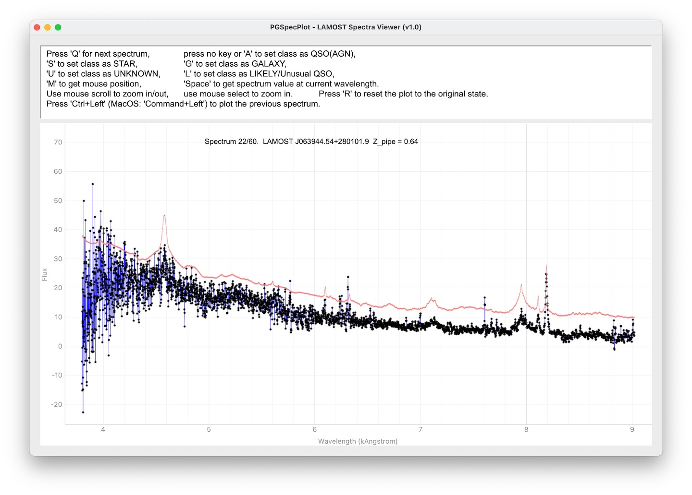

# specbox
A simple tool to manipulate and visualize optical spectra for astronomical research.

## Installation
### Dependencies
- `numpy`
- `scipy`
- `astropy`
- [`pyqtgraph`](https://www.pyqtgraph.org/)
- [`PySide6`](https://doc.qt.io/qtforpython-6/gettingstarted.html#getting-started)
- [`specutils`](https://specutils.readthedocs.io/en/stable/installation.html)
- `matplotlib`
- `pandas`

To install the latest version of specbox, run the following command in your terminal:

```bash
git clone https://github.com/rudolffu/specbox.git 
# or git clone https://gitee.com/rudolffu/specbox.git 
cd specbox
python -m pip install .
```

## Usage
### Main classes and functions
The main classes and functions of specbox are:
#### `basemodule.py`:
- `SpecLAMOST` and `SpecSDSS`: classes to read and manipulate spectra from the LAMOST and SDSS surveys, respectively.
- `SpecIRAF`: class to read and manipulate spectra from the IRAF format.
#### `qtmodule.py`:
- `PGSpecPlot`: class to plot spectra in a `pyqtgraph` plot.
- `PGSpecPlotApp`: class to create a `pyqtgraph` plot with a `QApplication` instance.
- `PGSpecPlotThread`: class to create a `pyqtgraph` plot in a thread.

### Examples
#### Plotting a spectrum from the LAMOST survey
```python
from specbox import SpecLAMOST

spec = SpecLAMOST('input_file.fits')
spec.plot()
# Smooth the spectrum
spec.smooth(5, 3, inplace=False)
```

#### Run a `PGSpecPlotThread` for visual inspection of a list of spectra
```python
from specbox import SpecLAMOST
from specbox.qtmodule import PGSpecPlotThread
from glob import glob

basepath = 'lamost_spec/fits_files/'
flist = glob(basepath+'*fits.gz')
flist.sort()
flist = flist[0:60]

a = PGSpecPlotThread(speclist=flist, SpecClass=SpecLAMOST, output_file='vi_output_test60.csv')
a.run()
```
