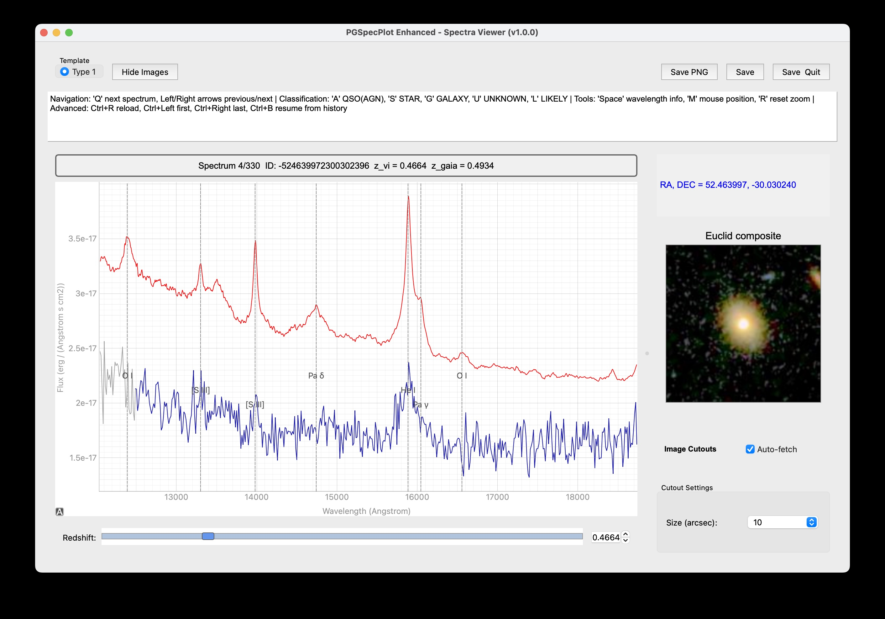

# specbox
[](https://specbox.readthedocs.io/en/latest/index.html)
[](https://pypi.org/project/specbox/)
[](https://doi.org/10.5281/zenodo.18642758)


A simple tool to manipulate and visualize UV/optical/NIR spectra for astronomical research.

## Documentation
Online documentation is hosted on Read the Docs: https://specbox.readthedocs.io/en/latest/index.html

## Citation
```bibtex
@software{fu_2026_18642758,
  author       = {Fu, Yuming},
  title        = {specbox: a simple tool to manipulate and visualize UV/optical/NIR spectra for astronomical research},
  month        = feb,
  year         = 2026,
  publisher    = {Zenodo},
  version      = {v1.0.0},
  doi          = {10.5281/zenodo.18642758},
  url          = {https://doi.org/10.5281/zenodo.18642758}
}
```


## License
GPLv3. See `LICENSE`.

## Installation
### Dependencies
- `numpy`
- `scipy`
- `astropy`
- [`pyqtgraph`](https://www.pyqtgraph.org/)
- [`PySide6`](https://doc.qt.io/qtforpython-6/gettingstarted.html#getting-started)
- [`specutils`](https://specutils.readthedocs.io/en/stable/installation.html)
- `matplotlib`
- `pandas`
- `pyarrow` or `fastparquet` (optional, for reading parquet spectra tables)
- `requests`
- `pillow` (PIL)
- `astroquery`

It is recommended to set up an isolated environment before installing (choose either option A or B):

```bash
# Option A: Python venv
python -m venv .venv
source .venv/bin/activate
python -m pip install --upgrade pip
```

```bash
# Option B: conda
conda create -n specbox python=3.13 -y
conda activate specbox
python -m pip install --upgrade pip
```

Install the stable release from PyPI (recommended):

```bash
python -m pip install specbox
```

To install a pre-release/development version from source:

```bash
git clone https://github.com/rudolffu/specbox.git  
cd specbox
python -m pip install .
```

## Usage
### Command-line tools

`specbox` installs five CLIs:

- `specbox-viewer`: launch the enhanced viewer
- `specbox-coadd`: coadd Euclid BGS+RGS chunks
- `specbox-euclid-parquet`: convert raw single-arm Euclid combined FITS to parquet
- `specbox-pcf`: run template PCF redshift and write `Z_TEMP`
- `specbox-merge-redshift-table`: merge external reference redshifts into spectra parquet files

```bash
# Viewer (history auto-loads when output CSV already exists)
specbox-viewer --spectra your_spectra.fits --spec-class euclid

# Viewer with image panel / cutout downloads enabled explicitly
specbox-viewer --spectra your_spectra.fits --spec-class euclid --images

# Viewer with an external reference-redshift table
specbox-viewer --spectra your_spectra.parquet --spec-class euclid \
  --redshift-table catalog.fits --redshift-key object_id --redshift-column Z

# AIMS-z review parquet (images are disabled by default)
specbox-viewer --spectra review_bundle_specbox.parquet --spec-class aimsz-review

# Coadd paired Euclid arms (default: EXTNAME intersection)
specbox-coadd --rgs-file rgs_chunk.fits --bgs-file bgs_chunk.fits --output-prefix coadd/out_chunk_001

# Convert raw single-arm Euclid FITS to parquet
specbox-euclid-parquet --fits rgs_chunk.fits --output-prefix parquet/rgs_chunk_001

# Merge an external redshift table into a spectra parquet file
specbox-merge-redshift-table --spectra your_spectra.parquet \
  --redshift-table catalog.fits --redshift-key object_id --redshift-column Z \
  --output your_spectra_with_zref.parquet --fill-z-vi

# PCF default: Type 1 only
specbox-pcf --fits coadd/out_chunk_001.fits

# PCF with Type 1 + Type 2 (ragn_na, internally limited to 0 < z < 3)
specbox-pcf --fits coadd/out_chunk_001.fits --enable-type2

# PCF with ragn_dr1 only (mapped to type1)
specbox-pcf --fits coadd/out_chunk_001.fits --ragn-dr1-only
```

## Development and releases

Package versions are derived from Git tags via `setuptools-scm`. Do not edit
`specbox.__version__` or hard-code a version in `pyproject.toml`; at runtime,
`specbox.__version__` is read from the installed package metadata.

For a release, create and push a version tag such as `v1.0.2`, then publish a
GitHub Release from that tag. The PyPI workflow builds from the release tag and
uploads only when the GitHub Release is published, not when a tag is pushed.

### Main classes and functions
The main classes and functions of specbox are:
#### `basemodule.py`:
- `SpecLAMOST` and `SpecSDSS`: classes to read and manipulate spectra from the LAMOST and SDSS surveys, respectively.
- `SpecIRAF`: class to read and manipulate spectra from the IRAF format.
- `SpecAIMSZReview`: parquet reader for AIMS-z review bundles with canonical string `objid` keys (`aimsz:{object_id}`).
- `SpecEuclid1d`: reader for Euclid combined 1D spectra, with `MASK`/`good_mask` support and optional `good_pixels_only=True`.
- `SpecEuclid1dDual`: paired Euclid reader for BGS+RGS with overlap scaling and merged/coadd-ready outputs.
- `SpecEuclidCoaddRow`: reader for dataframe/parquet rows containing coadded spectra arrays.
- `SpecPandasRow`: generic reader for "table-of-spectra" files readable by pandas (parquet/csv/feather/...), where each row stores arrays (e.g. wavelength/flux/ivar).
- `SpecSparcl`: SPARCL parquet/table reader (e.g., for file `sparcl_spectra.parquet`). Common metadata columns include `redshift`, `data_release`, `targetid`, and (optional) `euclid_object_id` for Euclid overlay.
#### `qtmodule.py`:
- `PGSpecPlot`: class to plot spectra in a `pyqtgraph` plot.
- `PGSpecPlotApp`: class to create a `pyqtgraph` plot with a `QApplication` instance.
- `PGSpecPlotThread`: class to create a `pyqtgraph` plot in a thread.

### Examples
#### Plotting a spectrum from the LAMOST survey
```python
from specbox import SpecLAMOST

spec = SpecLAMOST('input_file.fits')
spec.plot()
# Smooth the spectrum
spec.smooth(5, 3, inplace=False)
```

#### Reading a SPARCL parquet spectra table (one row per spectrum)
```python
from specbox.basemodule import SpecSparcl

# ext is a 1-based row index (ext=1 -> first row)
sp1 = SpecSparcl("sparcl_spectra.parquet", ext=1)
sp1.plot()
```

Default SPARCL parquet files with a scalar `redshift` column initialize
`sp1.redshift` and the viewer startup redshift `sp1.z_vi` from that value.
If `redshift` is missing or non-finite, `SpecSparcl` falls back to positive
finite `z_desi`, `z_sdss`, `z_ref`, then `z`.

#### Reading Euclid spectra from parquet rows
```python
from specbox.basemodule import SpecEuclid1d

sp = SpecEuclid1d("sz_ragn_dr1_rgs_chunk_001_part001.parquet", ext=1)
sp.plot()
```

Euclid parquet rows may use raw archive columns (`wavelength`, `flux` or `signal`,
`var`, `mask`, `quality`, `ndith`) or processed spectra columns. Processed files
can include redshift candidates; viewer startup uses the first positive finite
value in `z_vi > z_sdss > z_desi > z_hybrid > z_fusion > z_temp > z_pcf_best >
z_gaia > z_phot`. `z_temp` and `z_pcf_best` are treated as aliases, with
`z_temp` preferred when both are present.

#### Run the viewer on Euclid coadd parquet
```bash
specbox-viewer \
  --spectra coadd/sz_ragn_dr1_coadd_chunk_001_part001.parquet \
  --spec-class euclid-coadd
```

Images and cutout downloads are off by default. Use `--images` to opt in, or `--no-images` for an explicit image-off command line.

For `sparcl` and `aimsz-review`, the viewer now plots raw spectra by default. Use the `Downsample` toolbar toggle to enable pyqtgraph native downsampling and draw a black downsampled trace on top.
For dual-arm Euclid parquet inputs passed via `--rgs-file` and `--bgs-file`, the viewer pairs rows by shared `extname` (or `objid` fallback), not by row index.
When `--redshift-table` is provided, the viewer loads the external table once at startup and stores the matched value as `z_ref`; this remains an external overlay and is not part of the processed Euclid parquet priority list.

#### Run a `PGSpecPlotThread` for visual inspection of a list of spectra
```python
from specbox import SpecLAMOST
from specbox.qtmodule import PGSpecPlotThread
from glob import glob

basepath = 'lamost_spec/fits_files/'
flist = glob(basepath+'*fits.gz')
flist.sort()
flist = flist[0:60]

a = PGSpecPlotThread(speclist=flist, SpecClass=SpecLAMOST, output_file='vi_output_test60.csv')
a.run()
```

#### Run a viewer over a multi-row parquet file (SPARCL/table-of-spectra)
```python
from specbox.basemodule import SpecSparcl
from specbox.qtmodule import PGSpecPlotThreadEnhanced

viewer = PGSpecPlotThreadEnhanced(
    spectra="sparcl_spectra.parquet",
    SpecClass=SpecSparcl,
    # Optional: overlay Euclid spectrum when the parquet has `euclid_object_id`
    # and the Euclid combined FITS uses that ID as `EXTNAME`.
    euclid_fits="COMBINED_EUCLID_SPECS.fits",
    output_file="sparcl_vi_results.csv",
    z_max=6.0,
    load_history=True,
)
viewer.run()
```

Notes:
- Results CSV includes `targetid` and `data_release` (when available from the input table).
- The enhanced viewer has a `Save PNG` button that writes screenshots to `./saved_pngs/`.

